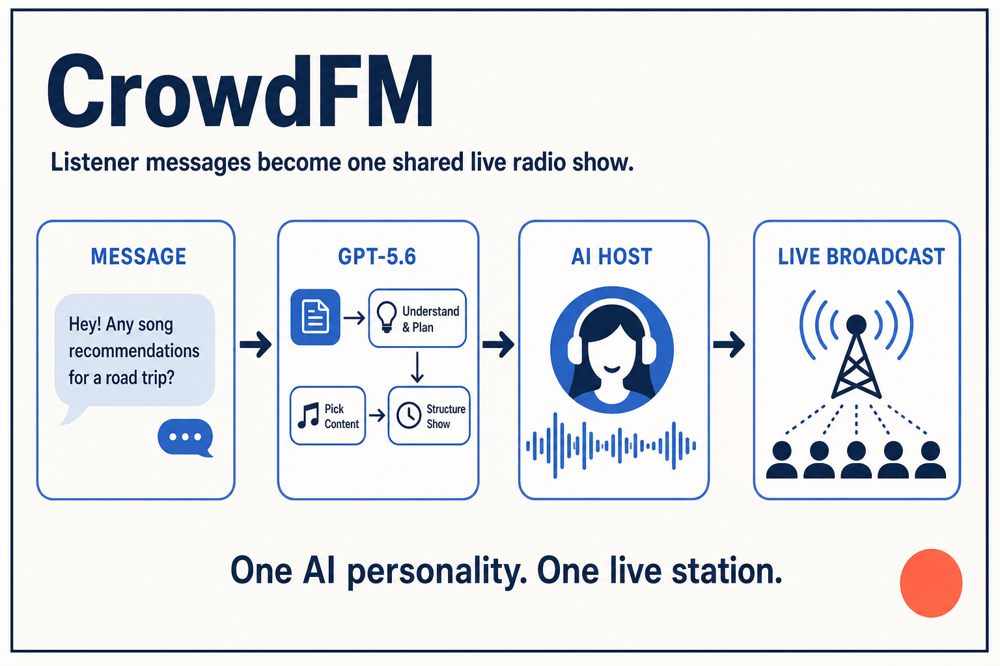

# CrowdFM



CrowdFM turns a listener message into a short radio show with a consistent AI host, an original song selected for that story, and a fixed airtime. Once the broadcast begins, it moves forward like radio: there is no pause, skip, replay, or scrub control.

Built for **OpenAI Build Week**, the MVP runs entirely on one local machine. It does not require a cloud deployment.

## Run the judge-ready real AI demo

Requirements:

- Node.js 24 or newer
- pnpm 11
- FFmpeg on `PATH`
- An OpenAI API key supplied by the judge
- `crowdfm-judge-audio-pack.zip`, attached to the Devpost submission

```bash
pnpm install
unzip /path/to/crowdfm-judge-audio-pack.zip
cp .env.example .env.local
pnpm dev
```

Before `pnpm dev`, edit `.env.local`:

```dotenv
CROWDFM_PROVIDER=openai
OPENAI_API_KEY=<your OpenAI API key>
CROWDFM_CATALOG_PATH=data/suno-tracks.json
```

Extract the pack at the repository root so its ten MP3s resolve as `assets/<Suno song ID>.mp3`. Open [http://localhost:3000](http://localhost:3000), submit the prefilled radio name and message, watch GPT-5.6 select a track and write the show, then press **Tune in** and wait for the 15-second scheduled airtime.

The judge pack contains only the ten selected beginning-to-first-hook excerpts that the runtime can play. It excludes the rejected candidates and unused portions of the masters, is not committed to Git, and is not covered by the repository's MIT License.

## API-key-free fallback

Mock mode still requires the judge audio pack because it replaces moderation, planning, and speech generation—not the selected music. Leave `CROWDFM_PROVIDER=mock` in `.env.local` to use the first catalog track with a deterministic script. macOS uses `say` for the mock host voice; other platforms fall back to generated tones.

## Real AI production flow

The submitted demo video and the judge-ready path use the real provider. The repository includes catalog metadata and generation-time rights evidence, while the Devpost attachment supplies the exact runtime excerpts without placing audio under the MIT-licensed source tree.

Real production uses:

- `omni-moderation-latest` to screen the listener message.
- `gpt-5.6` with strict Structured Outputs to select only an eligible catalog ID and write the intro and closing.
- `gpt-4o-mini-tts` with the `marin` voice to record both host segments.
- FFmpeg to normalize, trim, fade, and concatenate speech → music → speech into one MP3.
- A server-owned timeline to schedule airtime, restore late listeners at the live offset, and drive the visible cue state.

Model output cannot invent a song or path: the selected ID must resolve against the Zod-validated local catalog. API keys, prompts, provider bodies, source masters, and intermediate speech files never reach the browser.

## How Codex was used

I used Codex throughout the Build Week window to turn the initial idea into a tested product. The work included challenging the playlist-vs-radio concept, writing the product specification, designing the guarded production state machine and single-audio timeline, implementing the Next.js UI and Node routes, integrating GPT-5.6 and speech generation, building a deterministic Suno import/ranking pipeline, and driving behavior changes with Vitest and Playwright. The dated commit history and documents under `docs/` show that progression.

Human decisions remained explicit: the radio format, local-only scope, 15-second READY window, single continuous audio architecture, catalog themes, Suno prompts, generation plan, licensing boundary, and final editorial approval.

## Project structure

- `src/app/`: Next.js page and local API routes.
- `src/components/`: request, production, countdown, and broadcast UI.
- `src/lib/`: schemas, SQLite store, OpenAI/mock providers, production state machine, playback, and audio assembly.
- `e2e/`: browser-level request-to-broadcast journey.
- `data/`: generated-track catalog metadata, analysis, and rights record; no master audio.
- `docs/`: specification, ADRs, implementation plan, and submission material.
- `assets/`, `generated/`, `.crowdfm/`: ignored local inputs and runtime state.

## Verification

```bash
pnpm test
pnpm lint
pnpm typecheck
pnpm build
pnpm test:e2e
```

Automated tests always use mock providers. They never call OpenAI, spend credits, or depend on external media.

## Known boundaries

This is an isolated hackathon demo, not yet a shared internet station. It has no accounts, distributed queue, external database, public hosting, or multi-client drift correction. Suno generation is an offline editorial step; listener text is never sent to Suno.

Code is available under the [MIT License](LICENSE). Generated music is excluded from that license and from this repository; its provenance is recorded in `data/suno-generation-2026-07-17.md`.

See [the product specification](docs/crowdfm-spec.md) and [architecture decisions](docs/decisions/) for the full contract.
